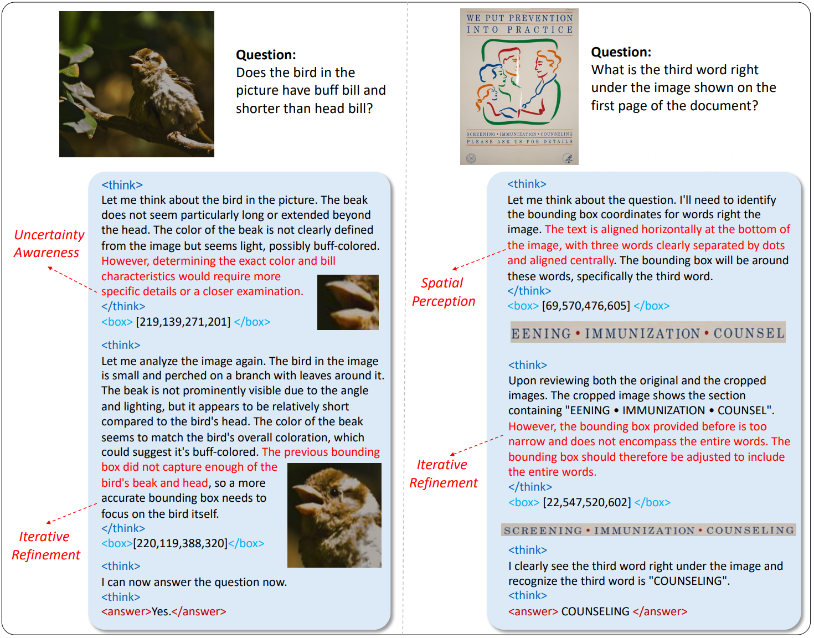
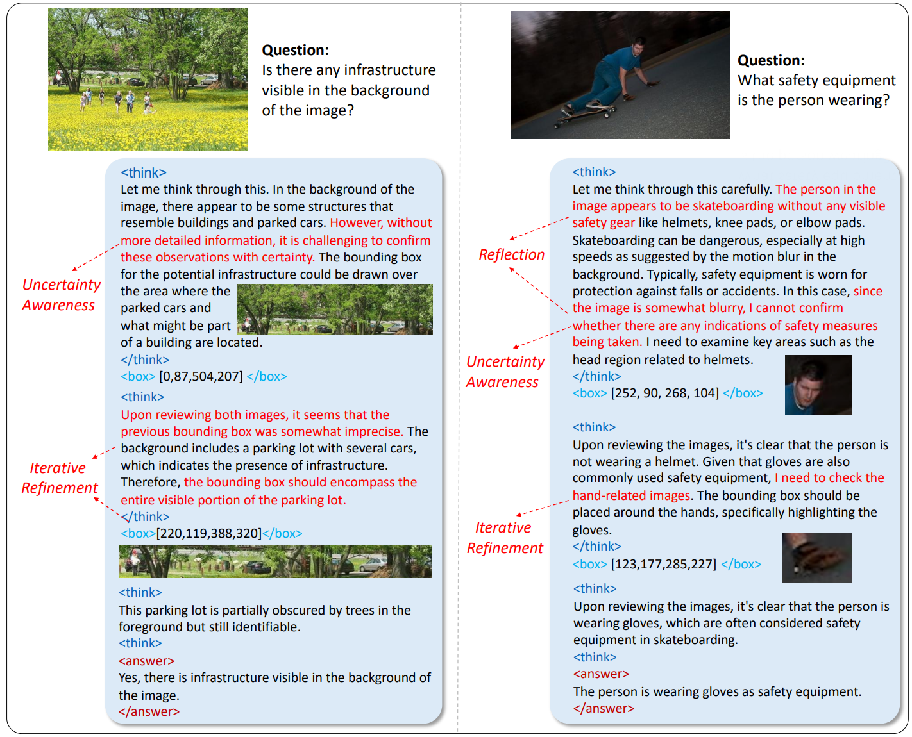
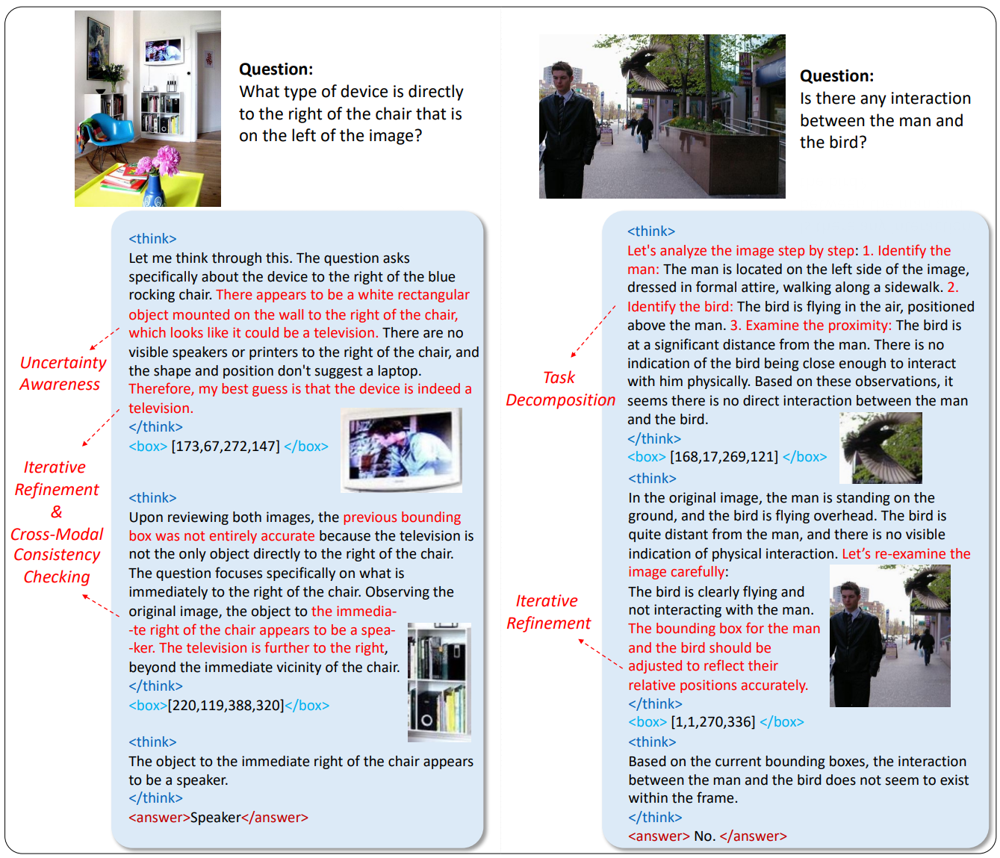
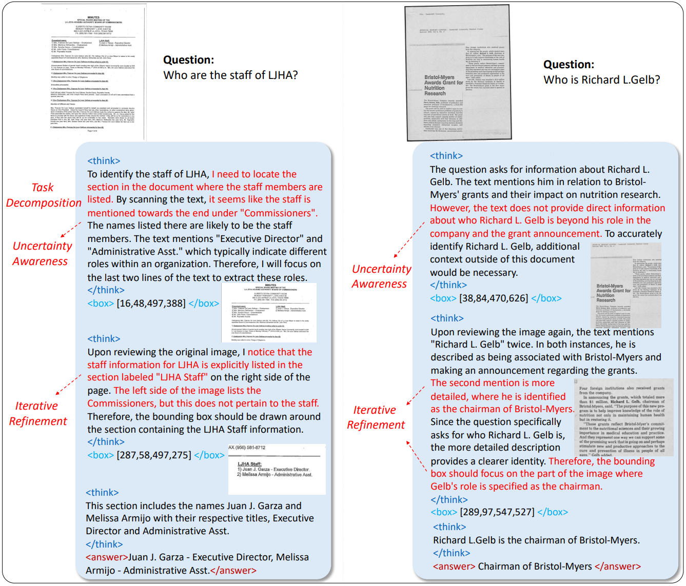
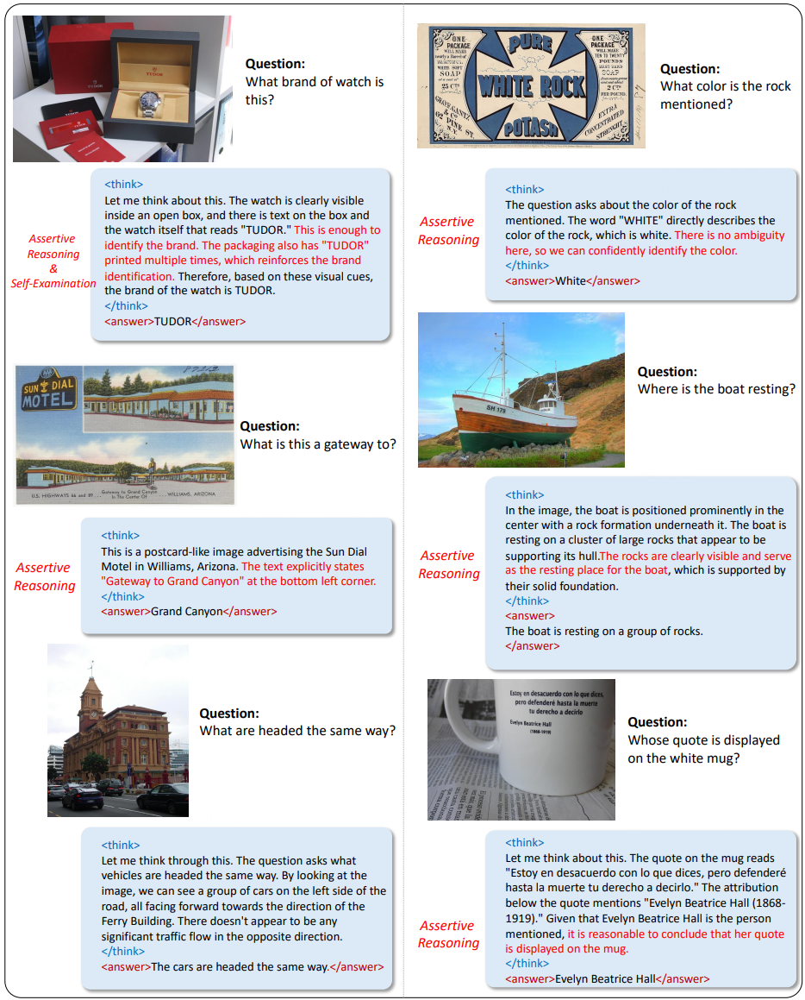
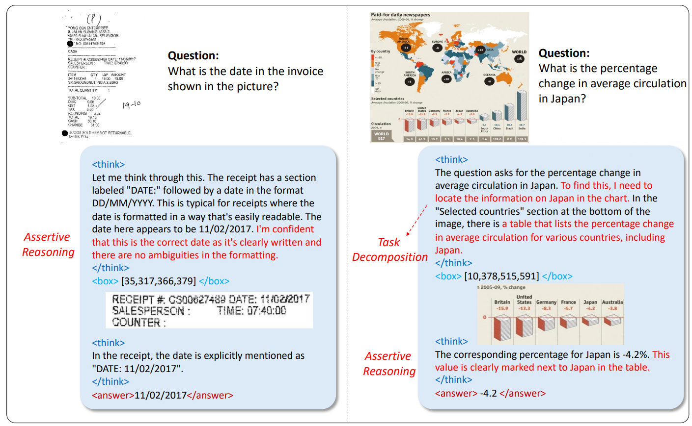
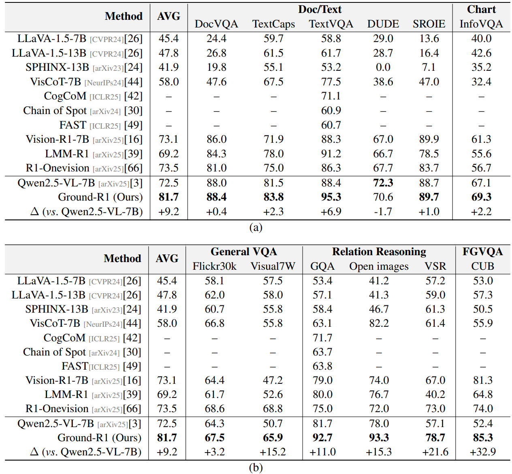
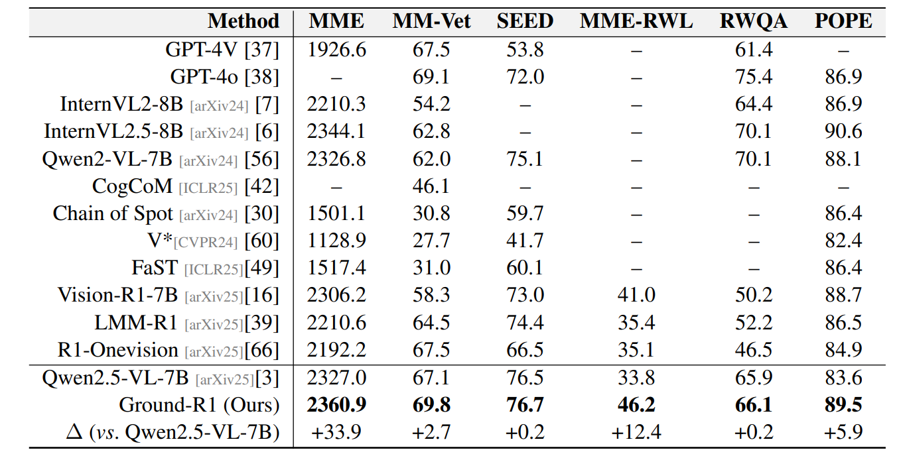
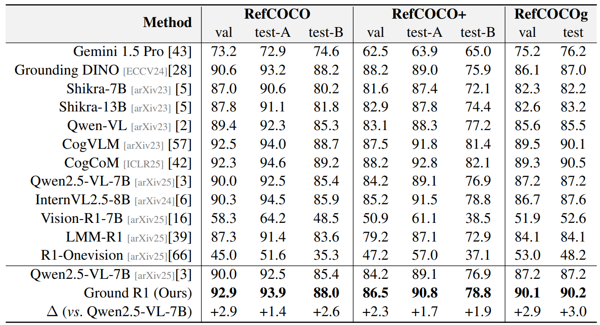
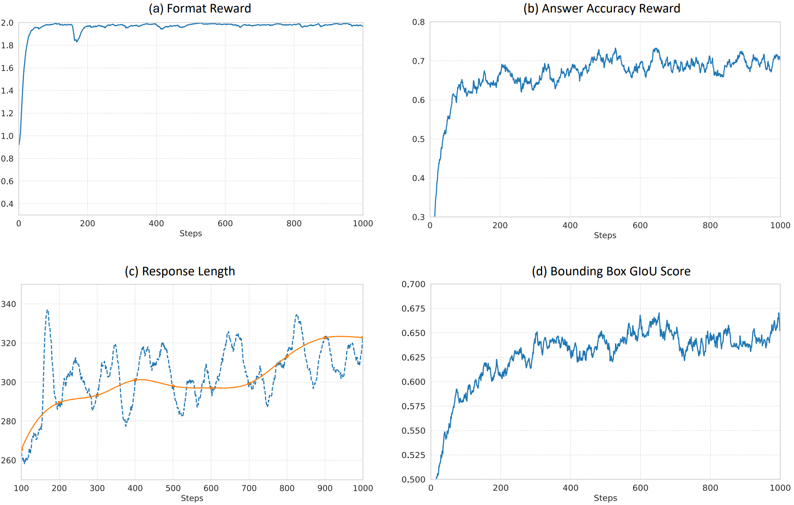

<p align="center" width="100%">
</p>
<h2 align="center"> <a href="https://arxiv.org/abs/2505.20272">Ground-R1: Incentivizing Grounded Visual Reasoning via Reinforcement Learning</a></h2>
<h5 align="center"> If you like our project, please give us a star ⭐ on GitHub for the latest update.</h5>
<h5 align=center>

[](https://huggingface.co/datasets/ZHZ2002/Ground-R1)
[](https://arxiv.org/abs/2505.20272)
[](https://github.com/PhysGame/PhysGame/blob/main/LICENSE)

<!-- 
<font size=7><div align='center' > [[📖 arXiv Paper](https://arxiv.org/abs/2505.20272)] [[📊 Dataset](https://github.com/BradyFU/Video-MME?tab=readme-ov-file#-dataset)][[🏆 Leaderboard](https://huggingface.co/PhysGame)]  </div></font>
-->

<p align="center">
    
</p>

## Latest Updates :loudspeaker:

* **[2025/06/09]**  Data for training and evaluation are released in our [huggingface repo](https://huggingface.co/datasets/ZHZ2002/Ground-R1).🤗
* **[2025/06/09]**  Code are available now! Welcome to **watch** 👀 this repository for the latest updates.

## Overview 👀

Large Vision-Language Models (LVLMs) have demonstrated impressive general capabilities across a wide range of multi-modal tasks. However, the reasoning processes of LVLMs often suffer from unreliable outputs and limited interpretability. To address this, grounded visual reasoning has emerged as a promising paradigm that enforces responses anchored on salient visual evidence regions. However, existing approaches typically rely on costly supervision such as bounding box annotations, chain-of-thought rationale or external tool calls, limiting their scalability. In this work, we propose **Ground-R1**, a reinforcement learning framework that enables grounded visual reasoning without requiring explicit evidence or rationale annotations. Ground-R1 consists of a grounding phase that generates evidence region rollouts based on format constraints, and an answering phase that produces responses guided by both answer correctness and format adherence rewards. Extensive experiments across multiple visual reasoning benchmarks manifest that Ground-R1 achieves superior performance and exhibits emergent cognitive behaviors such as uncertainty awareness, spatial perception, and iterative refinement, offering a scalable and interpretable alternative to existing approaches.

* We propose Ground-R1, a novel RL framework for grounded visual reasoning that eliminates the need for costly bounding box annotations, CoT rationales, and external tool calls.
* Ground-R1 decouples evidence region generation from answer synthesis, enabling interpretable reasoning via format-constrained grounding and reward-driven response generation.
* Extensive experiments across multiple benchmarks demonstrate that Ground-R1 achieves superior performance and exhibits emergent cognitive behaviors such as uncertainty awareness, spatial perception and iterative refinement.

## Reasoning trajectories of Ground-R1 🔥

<p align="center">
    
</p>

<div align='center' >
<details>
<summary> Click to expand more examples</summary>
<p align="center">
    
    
    
    
</details>
</div>

## Performance 🏆

<p align="center">
    
</p>

Evaluation results on the test split of [VisCoT benchmark](https://github.com/deepcs233/Visual-CoT?tab=readme-ov-file#model_zoo) including **doc/text** and **chart** understanding and **general VQA**, **relation reasoning**, and **fine-grained VQA (FGVQA)**.

Ground-R1 demonstrates substantial performance advantages over contemporary approaches: 1) Ground-R1 outperforms the baseline model [Qwen2.5-VL-7B](https://github.com/QwenLM/Qwen2.5-VL?tab=readme-ov-file) by $9.2\%$ on the average accuracy; 2) Compared to the recent grounded visual reasoning approach [CogCoM](https://github.com/THUDM/CogCoM), it achieves absolute improvements of $+24.2\%$ on TextVQA  and $+21.0\%$ on GQA; 3) Further more, our **Ground-R1** surpasses recent R1-series works (e.g., [R1-Onevision](https://github.com/Fancy-MLLM/R1-Onevision), [Vision-R1-7B](https://github.com/Osilly/Vision-R1) and [LMM-R1](https://github.com/TideDra/lmm-r1), empirically validating that introducing evidence grounding during reasoning processes effectively enhances multi-modal task-solving capabilities.

<p align="center">
    
</p>

To ensure comprehensive evaluation, we conduct systematic benchmarking across established LVLM benchmarks including **MME**, **MM-Vet**, **SEED-Bench**, **MME-RealWorld-Lite** (MME-RWL) , and **RealworldQA** for general capability evaluation and **POPE** for hallucination validation.

Ground-R1 demonstrates significant advantages over the baseline ([Qwen2.5-VL-7B](https://github.com/QwenLM/Qwen2.5-VL?tab=readme-ov-file)), existing grounded reasoning approaches ([CogCoM](https://github.com/THUDM/CogCoM), [Sys2-LLaVA](https://github.com/GuangyanS/Sys2-LLaVA), [VisCoT](https://github.com/deepcs233/Visual-CoT?tab=readme-ov-file#model_zoo)), and R1-series methods ([R1-Onevision](https://github.com/Fancy-MLLM/R1-Onevision), [Vision-R1-7B](https://github.com/Osilly/Vision-R1), [LMM-R1](https://github.com/TideDra/lmm-r1)). For instance, on the MME benchmark, **Ground-R1** achieves performance improvements of $33.9$ and $54.7$ points compared to Qwen2.5-VL-7B and Vision-R1-7B, respectively.

<p align="center">
    
</p>

Besides, We evaluate the visual grounding capabilities of Ground-R1 on **RefCOCO**, **RefCOCO+** and **RefCOCOg**.

Ground-R1 demonstrates superior visual grounding capabilities, achieving $92.9\%$ accuracy on RefCOCO val and surpassing most LVLMs, while narrowing the performance gap between generalist and specialist models (e.g., [Grounding DINO](https://github.com/IDEA-Research/GroundingDINO)).

## RL Training Curves 📈

<p align="center">
    
</p>

As shown, the format reward converges rapidly during the early training stages, while the accuracy reward stabilizes after approximately 600 steps. Additionally, the response length gradually increases with training steps, indicating the emergence of longer reasoning chains. 

The accuracy of the evidence regions generated by Ground-R1 ($\text{Bounding Box GIoU Score} = \frac{\text{GIoU} + 1}{2}$) steadily improves throughout training, reaching approximately $67.5\%$, despite the absence of bounding box supervision in the RL training process.

## Installation 🛠️

```bash
git clone https://github.com/zzzhhzzz/Ground-R1.git
cd Ground-R1
conda create --name ground-r1 python=3.10
conda activate ground-r1
bash setup.sh
```

Please download and unzip [VisCoT dataset](https://huggingface.co/datasets/deepcs233/Visual-CoT) for training and evaluation. Download and unzip [LVLM benchmarks](https://huggingface.co/datasets/ZHZ2002/Ground_R1_General_Eval) and [RefCOCO](https://huggingface.co/datasets/ZHZ2002/RefCOCO_ALL_Eval) for evaluation.

## Training 🚀

Add the path of the VisCoT folder to `scripts/run_grpo_video.sh`, then, 

```bash
cd Ground-R1
bash scripts/run_grpo_video.sh
```

## Inference & Evaluation 🔮

VisCoT Benchmark:

Please add your api_key and api_base to `eval/multi_baseline.sh` and `eval/multi_Ground_R1.sh`

```bash
cd Ground-R1
bash eval/multi_baseline.sh # For baseline model
bash eval/multi_Ground_R1.sh # For trained Ground-R1
```

LVLM Benchmarks:

```bash
bash eval_general_dataset/multi_Ground_R1.sh
```

Grounding Benchmarks:

```bash
bash eval/multi_RefCOCO.sh
```

## Ablation 📐

SFT Training:

Please add your dataset path (VisCoT) to `qwen-vl-finetune/scripts/prepare_SFT_data.sh`, then,

```bash
cd Ground-R1
bash qwen-vl-finetune/scripts/prepare_SFT_data.sh
```

Note: You can change `--max_steps` in `Vanilla_SFT.sh` and `Ground_SFT.sh` for a fair comparison, since Ground-R1 training only requires 8,000 samples.

```bash
cd qwen-vl-finetune
bash scripts/Vanilla_SFT.sh # For Vanilla SFT Training
bash scripts/Ground_SFT.sh # For Ground SFT Training
```

SFT Evaluation:

```bash
cd Ground-R1
### VisCoT Benchmark
bash eval/multi_baseline.sh # change --model_path for Vanilla SFT Eval
bash eval/multi_Ground_SFT.sh # For Ground SFT Eval
### LVLM Benchmarks
bash eval_general_dataset/multi_SFT.sh
```

## Acknowledgement 👍

Our code is built upon [Video-R1](https://github.com/tulerfeng/Video-R1), thanks for their excellent works!

## Citation ✏️

If you find the code and paper useful for your research, please consider staring this repo and citing our paper:

```
@article{cao2025ground,
  title={Ground-R1: Incentivizing Grounded Visual Reasoning via Reinforcement Learning},
  author={Cao, Meng and Zhao, Haoze and Zhang, Can and Chang, Xiaojun and Reid, Ian and Liang, Xiaodan},
  journal={arXiv preprint arXiv:2505.20272},
  year={2025}
}
```

